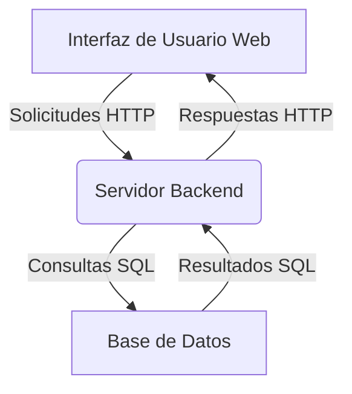

# CodeViz Research Context

> **Note**: This file contains research context from CodeViz. Most recent contexts are at the bottom.

---

## Research Query

visualizar el proceso de implementacion completo

*Session: 02dbe7dd5bfda9eabdb5bd870573dde2 | Generated: 3/7/2025, 17:00:04*

### Analysis Summary

# Proceso de Implementación Completo

Este informe detalla el proceso de implementación de la aplicación, abarcando desde la configuración del servidor hasta la interacción del cliente web con la API y la base de datos. La arquitectura se divide en componentes principales: el **Servidor Backend**, la **Base de Datos** y la **Interfaz de Usuario Web**.

## Arquitectura de Alto Nivel

La aplicación sigue un patrón cliente-servidor. El **Servidor Backend** ([api/server.js](api/server.js)) expone una API RESTful que es consumida por la **Interfaz de Usuario Web** ([public/index.html](public/index.html)). El servidor backend, a su vez, interactúa con la **Base de Datos** para persistir y recuperar información.

### Componentes Principales

*   **Servidor Backend**: Gestiona las solicitudes HTTP, procesa la lógica de negocio y se comunica con la base de datos.
*   **Base de Datos**: Almacena los datos de la aplicación.
*   **Interfaz de Usuario Web**: Proporciona la interacción al usuario y consume los servicios del backend.

## Servidor Backend

El **Servidor Backend** es el corazón de la aplicación, manejando las solicitudes de los clientes y orquestando las operaciones de la base de datos.

### Propósito
Proveer una API RESTful para la aplicación web, gestionar la lógica de negocio y la interacción con la base de datos.

### Partes Internas
El backend se compone principalmente de:
*   **Servidor Principal**: Configura y levanta el servidor HTTP.
*   **Módulos de Rutas**: Definen los endpoints de la API y sus manejadores.
*   **Módulo de Conexión a Base de Datos**: Establece y gestiona la conexión con la base de datos.
*   **Servicios Adicionales**: Como el servicio de clima ([api/weather-service.js](api/weather-service.js)).

### External Relationships
El servidor backend se comunica con:
*   La **Interfaz de Usuario Web** a través de solicitudes y respuestas HTTP.
*   La **Base de Datos** mediante consultas SQL.

### Implementación del Servidor

El servidor principal se encuentra en [api/server.js](api/server.js) y [api/server-web.js](api/server-web.js).
*   [api/server.js](api/server.js) parece ser el servidor principal que utiliza Express.js.
*   [api/server-web.js](api/server-web.js) podría ser una configuración alternativa o complementaria para el servidor web.

El archivo [package.json](package.json) define los scripts para iniciar el servidor:
*   `"start": "node main.js"`: Indica que [main.js](main.js) es el punto de entrada principal de la aplicación.
*   `"start-web": "node api/server-web.js"`: Un script específico para iniciar el servidor web.

## Base de Datos

La **Base de Datos** es responsable de la persistencia de los datos de la aplicación.

### Propósito
Almacenar de forma estructurada toda la información necesaria para el funcionamiento de la aplicación.

### Partes Internas
*   **Módulo de Conexión**: Encargado de establecer y mantener la conexión con la base de datos.
*   **Scripts SQL**: Para la inicialización, actualización y limpieza de la base de datos.

### External Relationships
La base de datos es accedida exclusivamente por el **Servidor Backend** para realizar operaciones CRUD (Crear, Leer, Actualizar, Eliminar).

### Implementación de la Conexión a Base de Datos

La lógica de conexión a la base de datos se encuentra en [src/database/conexion.js](src/database/conexion.js). Este módulo exporta la funcionalidad necesaria para interactuar con la base de datos.

Existen varios scripts SQL para la gestión de la base de datos:
*   [init-db.sql](init-db.sql): Para la inicialización de la base de datos.
*   [update-database.sql](update-database.sql): Para actualizaciones de esquema o datos.
*   [buquesbd_script.sql](buquesbd_script.sql): Un script SQL específico, posiblemente para datos de buques.
*   [cleanup-database.sql](cleanup-database.sql) y [cleanup-simple.sql](cleanup-simple.sql): Para la limpieza de la base de datos.

Además, hay scripts JavaScript que interactúan con la base de datos:
*   [cargar-datos.js](cargar-datos.js): Para cargar datos.
*   [check-database.js](check-database.js), [check-db.js](check-db.js), [revisar-bd.js](revisar-bd.js), [revisar-bd-completo.js](revisar-bd-completo.js): Para verificar el estado de la base de datos.
*   [update-db.js](update-db.js): Para actualizar la base de datos.
*   [test-db.js](test-db.js): Para pruebas de la base de datos.

## Interfaz de Usuario Web

La **Interfaz de Usuario Web** es la parte de la aplicación con la que el usuario final interactúa directamente.

### Propósito
Proporcionar una experiencia de usuario interactiva, visualizar datos y permitir la interacción con la lógica de negocio a través del **Servidor Backend**.

### Partes Internas
*   **Archivos HTML**: Definen la estructura de las páginas web.
*   **Archivos CSS**: Estilizan la interfaz de usuario.
*   **Archivos JavaScript**: Implementan la lógica del lado del cliente, incluyendo la comunicación con la API.
*   **Recursos Estáticos**: Imágenes, iconos, etc.

### External Relationships
La interfaz de usuario web se comunica con el **Servidor Backend** a través de llamadas a la API RESTful.

### Implementación de la Interfaz de Usuario Web

Los archivos de la interfaz de usuario se encuentran en el directorio [public/](public/).
*   [public/index.html](public/index.html): Es la página principal de la aplicación web.
*   [public/app-styles.css](public/app-styles.css): Contiene los estilos CSS de la aplicación.
*   [public/js/terminal-api.js](public/js/terminal-api.js): Contiene la lógica JavaScript para interactuar con la API del backend.
*   [public/js/buques-data.js](public/js/buques-data.js) y [public/js/datos-ejemplo.js](public/js/datos-ejemplo.js): Posiblemente contienen datos o lógica relacionada con la visualización de datos.
*   [public/horarios/principal.js](public/horarios/principal.js): Un script JavaScript específico para la sección de horarios.
*   [public/imagenes/](public/imagenes/): Contiene las imágenes y recursos gráficos utilizados en la interfaz.

Existen múltiples archivos `dashboard-*.html` ([public/dashboard-clean.html](public/dashboard-clean.html), [public/dashboard-final.html](public/dashboard-final.html), [public/dashboard-nuevo.html](public/dashboard-nuevo.html), [public/dashboard-premium.html](public/dashboard-premium.html), [public/dashboard.html](public/dashboard.html)) que sugieren diferentes versiones o diseños de un panel de control.

## Proceso de Implementación

El proceso de implementación completo implica la configuración y el despliegue de estos tres componentes principales para que trabajen en conjunto.

1.  **Configuración de la Base de Datos**:
    *   Se ejecuta [init-db.sql](init-db.sql) (o scripts similares como [buquesbd_script.sql](buquesbd_script.sql)) para crear el esquema de la base de datos y las tablas necesarias.
    *   Opcionalmente, se pueden cargar datos iniciales utilizando scripts como [cargar-datos.js](cargar-datos.js).

2.  **Despliegue del Servidor Backend**:
    *   Las dependencias de Node.js se instalan utilizando `npm install` (basado en [package.json](package.json)).
    *   El servidor se inicia, típicamente con `npm start` que ejecuta [main.js](main.js), o `npm run start-web` que ejecuta [api/server-web.js](api/server-web.js).
    *   El servidor comienza a escuchar en un puerto específico, listo para recibir solicitudes HTTP.

3.  **Despliegue de la Interfaz de Usuario Web**:
    *   Los archivos estáticos (HTML, CSS, JavaScript, imágenes) del directorio [public/](public/) se sirven a través de un servidor web (que puede ser el mismo servidor Node.js o uno separado como Nginx/Apache).
    *   Cuando un usuario accede a la URL de la aplicación, se carga [public/index.html](public/index.html) en su navegador.
    *   El JavaScript del lado del cliente ([public/js/terminal-api.js](public/js/terminal-api.js) y otros) se ejecuta en el navegador, realizando llamadas asíncronas a la API del backend para obtener y enviar datos.

Este flujo de trabajo permite que la aplicación funcione de manera cohesiva, con el frontend proporcionando la interacción, el backend gestionando la lógica y la base de datos asegurando la persistencia de la información.

