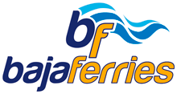

# 🌊 Terminal Dos Dashboard

**Dashboard Portuario Profesional para Puerto de La Paz, Baja California Sur**



## 📋 Descripción

Terminal Dos es un sistema de información portuaria en tiempo real que proporciona datos sobre arribos, salidas, condiciones climáticas y métricas operacionales del Puerto de La Paz.

## ✨ Características

- **🚢 Operaciones en Tiempo Real**: Arribos y salidas de buques
- **🌤️ Información Climática**: Condiciones meteorológicas de 3 puertos
- **📊 Dashboard Interactivo**: Métricas y estadísticas visuales
- **📱 Diseño Responsivo**: Compatible con dispositivos móviles
- **🎨 Interfaz Moderna**: Diseño glassmorphism náutico
- **⚡ API REST**: Endpoints para integración

## 🚀 Instalación Rápida

### Opción 1: Ejecutar Directamente
```bash
# 1. Abrir Terminal/PowerShell en la carpeta del proyecto
# 2. Ejecutar el archivo de inicio
start-dashboard.bat
```

### Opción 2: Instalación Manual
```bash
# 1. Instalar dependencias
npm install

# 2. Copiar configuración
copy .env.example .env

# 3. Iniciar servidor
npm start
```

## 🌐 Acceso

Una vez iniciado el servidor:

- **Dashboard Principal**: http://localhost:3000
- **API Status**: http://localhost:3000/api/status
- **API Completa**: http://localhost:3000/api/dashboard

## 📡 API Endpoints

| Endpoint | Método | Descripción |
|----------|---------|-------------|
| `/api/arribos` | GET | Lista de arribos programados |
| `/api/salidas` | GET | Lista de salidas programadas |
| `/api/clima` | GET | Clima de todos los puertos |
| `/api/clima/{puerto}` | GET | Clima específico (lapaz/mazatlan/topolobampo) |
| `/api/metricas` | GET | Métricas del dashboard |
| `/api/dashboard` | GET | Datos completos del dashboard |
| `/api/status` | GET | Estado del servidor |

## 📁 Estructura del Proyecto

```
terminal-dos/
├── api/
│   ├── server.js           # Servidor original
│   └── server-web.js       # Servidor web mejorado
├── public/
│   ├── dashboard-nuevo.html # Dashboard principal
│   ├── js/
│   │   └── terminal-api.js  # Cliente API
│   └── imagenes/           # Recursos gráficos
├── .env.example           # Configuración de ejemplo
├── package-web.json       # Dependencias web
└── start-dashboard.bat    # Script de inicio
```

## ⚙️ Configuración

### Variables de Entorno (.env)

```env
PORT=3000
NODE_ENV=development
WEATHER_API_KEY=tu_api_key_aqui
DB_HOST=localhost
DB_USER=terminal_user
DB_PASSWORD=terminal_password
```

### Personalización

- **Colores**: Modificar variables CSS en `dashboard-nuevo.html`
- **Datos**: Actualizar mock data en `server-web.js`
- **APIs**: Configurar keys en `.env`

## 🔧 Desarrollo

### Comandos Disponibles

```bash
npm start          # Iniciar servidor
npm run dev        # Modo desarrollo con auto-reload
npm run build      # Construir para producción
npm run deploy     # Desplegar a servidor
```

### Estructura de Datos

#### Arribos/Salidas
```json
{
  "id": 1,
  "naviera": "BAJA FERRIES",
  "buque": "Santa Rita",
  "origen": "Mazatlán",
  "hora": "08:30:00",
  "estado": "Confirmado",
  "muelle": "A-1"
}
```

#### Clima
```json
{
  "lapaz": {
    "temperatura": 28,
    "condicion": "Soleado",
    "icono": "☀️",
    "viento": "15 km/h NE",
    "status": "favorable"
  }
}
```

## 🌐 Despliegue en Producción

### Opción 1: Servidor Dedicado
```bash
# En el servidor
git clone [repo-url]
cd terminal-dos
npm install --production
npm start
```

### Opción 2: Hosting Web
- Subir archivos a hosting
- Configurar Node.js
- Establecer variables de entorno
- Iniciar aplicación

### Opción 3: Docker
```dockerfile
FROM node:16-alpine
WORKDIR /app
COPY package*.json ./
RUN npm install --production
COPY . .
EXPOSE 3000
CMD ["npm", "start"]
```

## 📱 Distribución Empresarial

### Para Jefes/Supervisores
1. **Acceso Web**: Enviar URL del dashboard
2. **App Desktop**: Convertir con Electron (opcional)
3. **Acceso Móvil**: Compatible con tablets/móviles

### Para Personal Operativo
- **Pantallas Públicas**: Modo kiosco en navegador
- **Impresión**: Reportes desde navegador
- **Integración**: APIs para otros sistemas

## 🔐 Seguridad

- Variables de entorno para datos sensibles
- CORS configurado
- Validación de entrada
- Rate limiting (para producción)

## 📞 Soporte

### Problemas Comunes

**Error: No se puede conectar**
- Verificar que el puerto 3000 esté libre
- Comprobar firewall/antivirus

**Datos no actualizan**
- Limpiar cache del navegador
- Verificar conexión a internet

**Instalación falla**
- Verificar Node.js versión 16+
- Instalar dependencias manualmente

### Contacto

- **Desarrollador**: Terminal Dos Team
- **Email**: soporte@terminal-dos.mx
- **Versión**: 1.0.0

## 📄 Licencia

MIT License - Libre para uso comercial y personal.

---

**🌊 Terminal Dos Dashboard - Conectando el Puerto con la Tecnología 🌊**
